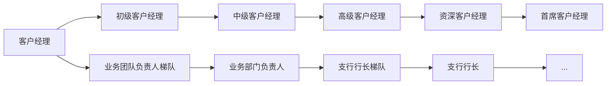

## 《走进普惠》

### 精准定位

> 什么是普惠金融

1. 原则：机会平等和商业可持续发展
2. 对象：小微企业、农民、城镇低收入人群、贫苦人群和残疾人、老年人等特殊群体

> 市场定位：立足小微践行普惠

巩固小（小企业）、突出微（普惠金融条线）：

> 客群特征

- 两民：市民、农民
- 两有一无：劳动能力与意愿、无不良嗜好
- 风险：文化性、稳定性、简单性、周期性
- 收益：规模性、紧缺性、成长性、关联性

### 服务体系

> 五个一

- 一圈子：社区化经营
    - 意义：降本增效、信息对称、提升服务、模式复制、品牌推广、把控风险
- 一杆子：相对批量化
    - 理念：共性客群、其中作业
    - 内涵：基于社区化经营，借助平台和关键人，系统切入，批量化开展标准化作业
    - 目标：提升获客效率、降低作业成本、提升客户体验、增强风险把控
- 一家子：家庭金融计划
    - 家庭关联金融服务，家庭账户
- 一辈子：个人金融计划
- 一篮子：大服务体系，多元化、一站式、全方位服务
    - 内涵：扎根社区、跨界合作、增值服务、共享生态圈
    - 案例：商户优惠券、打折、金融便利店，增值服务

### 方法

---

## 《银行通用产品》

1. 一级品种：泰隆普惠
2. 二级品种：
    1. 易富（存款、理财）
    2. 易贷、易汇、易生活

> 存款产品体系：特点、优势、适用对象

- 通用存款产品
    - 活期存款
    - 定期存款
    	- 整取整存
      - 零存整取
      - 整存零取
      - 存本取息
    - 定活两便存款
- 通知存款
    - 协定存款
    
- 特殊存款产品
    - 泰隆新一本通
    - 大额存单
    - 结构性存款
    - 隆情系列存款
        - 长寿乐
        - 成长乐

> 通用存款产品个人系列

1. 四大原则：存款资源、取款自有、存款有息、为存款人保密

- 个人活期存款：不限定存期、随存随取、按**支取日**挂牌活期利率计息、按季结息**季末20日**、利息计入本金
    - 年、月、日利率，央行利率调整
    - 资金来源：流动性资金、贷款理财、工资库
- 个人定期存款：
    - 整取整存（全部或部分支取本金利息）
        - 50元起存、可部分支取两次
        - 存单、存折、借记卡
        - 6档：3m, 6m, 1y, 3y, 5y
        - 到期支取（约定利率）、逾期支取（有无转存）、提取支取（活期利率、利息加本金）
        - 收益高、自动续存
        - 质押贷款、避免利息损失
    - 零存整取（每月固定存款、一次支取本息）5元起
    - 整存零取（本金一次存入、每月）
    - 存本取息（本金大5000起、分次支取利息）
- 定活两便存款
    - 50元起存、可部分支取两次、不约定存期、一次存入本息、随时支取
    - 活期、3月、6月、1年（满三个月、不满6个月，支取日打六折）
    - 产品渠道：存单、柜台
    - 收益：
- 个人通知存款
    - 不约定存期、提前通知（）
    - 5万起存、最低留存5万、可多次支取
    - 1天、7天通知存款
    - 存单、借记卡下挂、柜台、网银、手机银行
    - 支取日计息

| 产品名称         | 存取规则/条件                              | 存期档次                   | 产品载体                       | 渠道                 | 产品收益                         |
| ---------------- | ------------------------------------------ | -------------------------- | ------------------------------ | -------------------- | -------------------------------- |
| 个人活期         | 无起存金额限制、部支不限                   | 不约定存期                 | 借记卡、存折                   | 柜台、网银、手机银行 | **支取日**挂牌活期利率、按季结息 |
| 个人整存整取定期 | 50元起存、可部分支取两次                   | 3月6月1年2年3年5年         | 个人定期存单、存折、借记卡下挂 | 柜台、网银、手机银行 | **存入日**挂牌整存整取利率       |
| 定活两便         | 50元起存、可随时支取、只能部分支取两次     | 活期、3月、6月、1年        | 存单                           | 柜台                 | **支取日**存期不同、计息方式不同 |
| 个人通知         | 5万元起存、多次部支、最低5万元、预留伍万元 | 一天通知存款、七天通知存款 | 存单                           | 柜台、网银、手机银行 | **支取日**挂牌通知存款利率       |

个人存款产品

---

## 单位系列产品

> 单位：个体工商户、机关、企业、部队

| 四类账户 | 基本存款账户 | 一般存款账户 | 专用存款账户                 | 临时存款账户        |
| -------- | ------------ | ------------ | ---------------------------- | ------------------- |
| 账户数目 | 1个          | 多个         |                              |                     |
|          | ✅日常转账    | ✅现金存缴    | 建设资金、信托资金、工资账户 | 规定期限内使用2年内 |
|          | ✅现金收付    | ❌现金支取    |                              | 现金支付、结算      |

| 名称         | 存取规则/条件                                       | 存期档次 | 产品载体 | 渠道 |
| ------------ | --------------------------------------------------- | -------- | -------- | ---- |
| 单位活期存款 |                                                     |          |          |      |
| 单位定期存款 | 起存1万元、整笔存入、约定期限、到期本息（部支一次） |          |          |      |
| 单位通知存款 | 起存50万元、不约定存期、约定取日期                  |          |          |      |
| 单位协定存款 | （基本存款、一般存款账户）合同定期、额度（30万元）  |          |          |      |
| 保证金存款   |                                                     |          |          |      |

---

## 泰隆特殊存款产品

| 产品                     | 存取规则、条件                                               | 收益                                                         | 存期档次               | 产品载体     | 渠道                                   |
| ------------------------ | ------------------------------------------------------------ | ------------------------------------------------------------ | ---------------------- | ------------ | -------------------------------------- |
| 泰隆一本通（个人客户）   | 1万起存、留存1万、部支不限（1000元）、不约定存期             | 整存争取、通知存款计息（按照最长期的档次利率整段计息）       | 1、7d、3、6m、1、2、3y | 存折、借记卡 | 柜台、网银、手机银行                   |
| 大额存单（可转让）记账式 | 非金融机构（纸质持有证明、时点证明）个人20W\一元递增、企业1KW\一万元递增 | 定期(按月付息55%)、到期付息大额存单、保本保息、存入日定息、  | 1月1年18月3年          | 活期结算账户 | 柜台、手机银行、网上银行               |
| 结构性存款（理财）       | 风险能力评估、柜面双录、1万、2千万、不能提前支取             | 保本浮动收益（挂钩金融衍生品）分行财富管理部门沟通（募集期内外） | 3、6、12月             | 活期结算账户 | 个人：柜台、网银、手机银行、单位：柜台 |
| 长寿乐（老年人）         | 55周岁、1千元、部支不限                                      |                                                              |                        | 银行卡、存折 | 柜台                                   |
| 成长乐（儿童、青少年）   |                                                              |                                                              |                        | 存折、卡     | 首次柜台、手机银行                     |

|              | 大额存单到期付息产品                                         | 大额存单定期付息产品                                         |
| ------------ | ------------------------------------------------------------ | ------------------------------------------------------------ |
| 付息方式     | 到期还本付息                                                 | 定期付息 - 月                                                |
| 起点金额     | 个人20W企业1000万                                            |                                                              |
| 最小递增金融 | 个人1元，1万元                                               |                                                              |
| 到期日       | 起息日起至存期满，对年对月对日                               |                                                              |
| 付息日       | 到期日支付本金和利息                                         | 付息日为存入日对应日期，如付息日没有对应日期，则付息日为该月月末，最后一笔利息与本金一起到期支付 |
| 利息计算天数 | 起息日（含）至到期日（不含）整月整年天数（1个月按30天、一年按360天），提取支取时自起息日（含）至支取日（不含）的整月按30天，不足整月部分按实际天数。 |                                                              |
| 提取支取条款 | 允许全额或多次**部分**提取支取，部分提前支取后的本金余额**不低于20万（1000万）**。提前支取按照支取日我行协定存款挂牌利率计算 | 值允许**一次**全额提前支取，提前支取按照支取日我行协定存款挂牌利率计息 |
| 转让         | ✅                                                            | ❌                                                            |

---

## 开启理财业务之门

> 概述

1. 定义：客户财务状况（风险评估）、投资需求、实现客户理财目标，
2. 特点：轻资本业务，客户承担风险、金融知识技术密集型
3. 分类：
    1. 募集方式：公募（公开）、私募（非公开）
    2. 投资性质：80%固定收益类、权益类、商品及金融衍生品类、混合类
    3. 运作方式：

> 操作流程

> 规则

> 产品介绍

## 《泰隆，我们共同的家》

### 发展平台介绍

目标：职业发展、福利制度

1. 发展平台：29个智能部门、13家分行、300家支行、多加村镇银行

**职业发展路径 - 客户经理**

### 薪酬体系

- 短期报酬
- 长期报酬
- 福利

$$
工资 = 年薪 \times 30\\% + 计奖基数 \times 50\\% + 计奖基数 \times 50\\% \times 考核分
$$

- 基值、超基值记奖
    - 存款、普通贷款、贸易融资、准贷记卡、随带通卡管户FTP营业收入和手续费提成奖励
- 单项记奖
    - 国际业务、理财业务、票据贴现、结构性存款FTP提成奖励
    - 贷记卡卡量奖励
    - 贷款推荐奖励、贷款审查奖励
    - 非营销人员存款奖励

> 职级体系

- 年初履职调整

### 薪酬福利

- 生活关怀：综合性商业保险、营养早餐、月度生活福利、夏季降温物资
- 温馨补贴：车辆补贴、异地派遣补贴
- 年度休闲：年度体检、带薪休假、工间小憩、周五正装日、年度旅游
- 员工贷款：员工消费贷款、购车贷款

## 泰隆人行为准则

> 三誉三感：信誉、名誉、荣誉、认同感、责任感、使命感

> 我与企业、工作、同事、客户

## 反洗钱

> 认识洗钱、反洗钱

- 隐瞒、掩饰非法资金来源和性质
- 七类上游犯罪
    - 
- 洗钱方式
    - 赌场
    - 保险
    - 艺术品拍卖
    - 海外投资

> 三个阶段：处置阶段、离析阶段、融合阶段（甩干）

> 识别客户身份：规定金额以上

- 初次识别、持续识别、重新识别
    - 初次识别
        - 开户：普通客户，特定自然人（政要、国际组织高管）
        - 一次性金融服务：未开户，RMB 1万元 1000美元
    - 持续识别
        - 自然人现金存取：5万元、1万元美金
        - 代理办理业务：
            - 转账、取款：被代理人（联网核查）、
            - 存款：审核代理人。
        - 证件过期
            - 通知更新，过期前1个月
    - 重新识别
        - 
- 核对、登记、留存

> 受益所有人

> 保存客户身份资料与交易记录（最少5年）

> 大额交易报告：规定金额

- 当日单笔或累计交易人民币5万元外币1万美金以上的现金收支
- 非自然人客户银行账户与其他银行账户发生单笔或累计200万元外币20万美金以上的款项划转
- 自然人账户50、10万
- 境外20万、1万美金

原则：单边交易、"孰低原则"

> 报告可疑交易

- 分析审核：
    - 案例特征
    - 身份、经营、财务、信贷系统、核心系统、外部工商
    - 资金来源、去向
    - 分析判断
    - 案例意见：身份特征、交易特征（来源、用途、去向）、行为特征（交易渠道偏好、视频）分析过程、判断结论。

- 持续监测、提高客户风险等级、限制交易、终止业务关系

## 一线员工的声誉风险防范与应对

