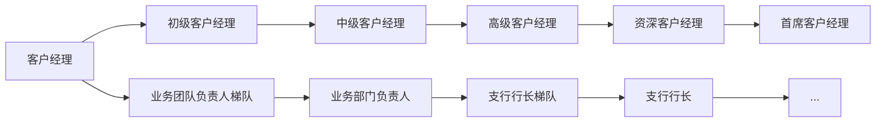

- 净值型、预期收益型

## 《走进普惠》

### 精准定位

> 什么是普惠金融

1. 原则：机会平等和商业可持续发展
2. 对象：小微企业、农民、城镇低收入人群、贫苦人群和残疾人、老年人等特殊群体

> 市场定位：立足小微践行普惠

巩固小（小企业）、突出微（普惠金融条线）：

> 客群特征

- 两民：市民、农民
- 两有一无：劳动能力与意愿、无不良嗜好
- 风险：文化性、稳定性、简单性、周期性
- 收益：规模性、紧缺性、成长性、关联性

### 服务体系

> 五个一

- 一圈子：社区化经营
    - 意义：降本增效、信息对称、提升服务、模式复制、品牌推广、把控风险
- 一杆子：相对批量化
    - 理念：共性客群、其中作业
    - 内涵：基于社区化经营，借助平台和关键人，系统切入，批量化开展标准化作业
    - 目标：提升获客效率、降低作业成本、提升客户体验、增强风险把控
- 一家子：家庭金融计划
    - 家庭关联金融服务，家庭账户
- 一辈子：个人金融计划
- 一篮子：大服务体系，多元化、一站式、全方位服务
    - 内涵：扎根社区、跨界合作、增值服务、共享生态圈
    - 案例：商户优惠券、打折、金融便利店，增值服务

### 方法

> 社区化经营五步法

- 一选：选择社区、客户
    - 充分调研、社区规划、社区建档
    - 选社区、客户
- 二找：寻找关键人、平台、渠道，以点带面，树藤摸瓜
- 三进：
    - 客户建档、一户一档
    - 信贷类客户、财富管理类、结算类、非金融服务类
- 四沉：
    - 客户分层：正式客户，有效非有效
    - 客户维护：
    - 生态建设：扎根社区、跨界合作、增值服务、共享生态圈
- 五评：
    - 过程评估
    - 结果评估

---

## 《银行通用产品》

1. 一级品种：泰隆普惠
2. 二级品种：
    1. 易富（存款、理财）
    2. 易贷、易汇、易生活

> 存款产品体系：特点、优势、适用对象

- 通用存款产品
    - 活期存款
    - 定期存款
    	- 整取整存
      - 零存整取
      - 整存零取
      - 存本取息
    - 定活两便存款
- 通知存款
    - 协定存款
    
- 特殊存款产品
    - 泰隆新一本通
    - 大额存单
    - 结构性存款
    - 隆情系列存款
        - 长寿乐
        - 成长乐

> 通用存款产品个人系列

1. 四大原则：存款资源、取款自有、存款有息、为存款人保密

- 个人活期存款：不限定存期、随存随取、按**支取日**挂牌活期利率计息、按季结息**季末20日**、利息计入本金
    - 年、月、日利率，央行利率调整
    - 资金来源：流动性资金、贷款理财、工资库
- 个人定期存款：
    - 整取整存（全部或部分支取本金利息）
        - 50元起存、可部分支取两次
        - 存单、存折、借记卡
        - 6档：3m, 6m, 1y, 3y, 5y
        - 到期支取（约定利率）、逾期支取（有无转存）、提取支取（活期利率、利息加本金）
        - 收益高、自动续存
        - 质押贷款、避免利息损失
    - 零存整取（每月固定存款、一次支取本息）5元起
    - 整存零取（本金一次存入、每月）
    - 存本取息（本金大5000起、分次支取利息）
- 定活两便存款
    - 50元起存、可部分支取两次、不约定存期、一次存入本息、随时支取
    - 活期、3月、6月、1年（满三个月、不满6个月，支取日打六折）
    - 产品渠道：存单、柜台
    - 收益：
- 个人通知存款
    - 不约定存期、提前通知（）
    - 5万起存、最低留存5万、可多次支取
    - 1天、7天通知存款
    - 存单、借记卡下挂、柜台、网银、手机银行
    - 支取日计息

| 产品名称         | 存取规则/条件                              | 存期档次                   | 产品载体                       | 渠道                 | 产品收益                         |
| ---------------- | ------------------------------------------ | -------------------------- | ------------------------------ | -------------------- | -------------------------------- |
| 个人活期         | 无起存金额限制、部支不限                   | 不约定存期                 | 借记卡、存折                   | 柜台、网银、手机银行 | **支取日**挂牌活期利率、按季结息 |
| 个人整存整取定期 | 50元起存、可部分支取两次                   | 3月6月1年2年3年5年         | 个人定期存单、存折、借记卡下挂 | 柜台、网银、手机银行 | **存入日**挂牌整存整取利率       |
| 定活两便         | 50元起存、可随时支取、只能部分支取两次     | 活期、3月、6月、1年        | 存单                           | 柜台                 | **支取日**存期不同、计息方式不同 |
| 个人通知         | 5万元起存、多次部支、最低5万元、预留伍万元 | 一天通知存款、七天通知存款 | 存单                           | 柜台、网银、手机银行 | **支取日**挂牌通知存款利率       |

个人存款产品

---

## 单位系列产品

> 单位：个体工商户、机关、企业、部队

| 四类账户 | 基本存款账户 | 一般存款账户 | 专用存款账户                 | 临时存款账户        |
| -------- | ------------ | ------------ | ---------------------------- | ------------------- |
| 账户数目 | 1个          | 多个         |                              |                     |
|          | ✅日常转账    | ✅现金存缴    | 建设资金、信托资金、工资账户 | 规定期限内使用2年内 |
|          | ✅现金收付    | ❌现金支取    |                              | 现金支付、结算      |

| 名称         | 存取规则/条件                                       | 存期档次 | 产品载体 | 渠道 |
| ------------ | --------------------------------------------------- | -------- | -------- | ---- |
| 单位活期存款 |                                                     |          |          |      |
| 单位定期存款 | 起存1万元、整笔存入、约定期限、到期本息（部支一次） |          |          |      |
| 单位通知存款 | 起存50万元、不约定存期、约定取日期                  |          |          |      |
| 单位协定存款 | （基本存款、一般存款账户）合同定期、额度（30万元）  |          |          |      |
| 保证金存款   |                                                     |          |          |      |

---

## 泰隆特殊存款产品

| 产品                     | 存取规则、条件                                               | 收益                                                         | 存期档次               | 产品载体     | 渠道                                   |
| ------------------------ | ------------------------------------------------------------ | ------------------------------------------------------------ | ---------------------- | ------------ | -------------------------------------- |
| 泰隆一本通（个人客户）   | 1万起存、留存1万、部支不限（1000元）、不约定存期             | 整存争取、通知存款计息（按照最长期的档次利率整段计息）       | 1、7d、3、6m、1、2、3y | 存折、借记卡 | 柜台、网银、手机银行                   |
| 大额存单（可转让）记账式 | 非金融机构（纸质持有证明、时点证明）个人20W\一元递增、企业1KW\一万元递增 | 定期(按月付息55%)、到期付息大额存单、保本保息、存入日定息、  | 1月1年18月3年          | 活期结算账户 | 柜台、手机银行、网上银行               |
| 结构性存款（理财）       | 风险能力评估、柜面双录、1万、2千万、不能提前支取             | 保本浮动收益（挂钩金融衍生品）分行财富管理部门沟通（募集期内外） | 3、6、12月             | 活期结算账户 | 个人：柜台、网银、手机银行、单位：柜台 |
| 长寿乐（老年人）         | 55周岁、1千元、部支不限                                      |                                                              |                        | 银行卡、存折 | 柜台                                   |
| 成长乐（儿童、青少年）   |                                                              |                                                              |                        | 存折、卡     | 首次柜台、手机银行                     |

|              | 大额存单到期付息产品                                         | 大额存单定期付息产品                                         |
| ------------ | ------------------------------------------------------------ | ------------------------------------------------------------ |
| 付息方式     | 到期还本付息                                                 | 定期付息 - 月                                                |
| 起点金额     | 个人20W企业1000万                                            |                                                              |
| 最小递增金融 | 个人1元，1万元                                               |                                                              |
| 到期日       | 起息日起至存期满，对年对月对日                               |                                                              |
| 付息日       | 到期日支付本金和利息                                         | 付息日为存入日对应日期，如付息日没有对应日期，则付息日为该月月末，最后一笔利息与本金一起到期支付 |
| 利息计算天数 | 起息日（含）至到期日（不含）整月整年天数（1个月按30天、一年按360天），提取支取时自起息日（含）至支取日（不含）的整月按30天，不足整月部分按实际天数。 |                                                              |
| 提取支取条款 | 允许全额或多次**部分**提取支取，部分提前支取后的本金余额**不低于20万（1000万）**。提前支取按照支取日我行协定存款挂牌利率计算 | 值允许**一次**全额提前支取，提前支取按照支取日我行协定存款挂牌利率计息 |
| 转让         | ✅                                                            | ❌                                                            |

---

## 开启理财业务之门

> 概述

1. 定义：客户财务状况（风险评估）、投资需求、实现客户理财目标，
2. 特点：轻资本业务，客户承担风险、金融知识技术密集型
3. 分类：
    1. 募集方式：公募（公开）、私募（非公开）
    2. 投资性质：80%固定收益类、权益类、商品及金融衍生品类、混合类
    3. 运作方式：开放式理财产品、封闭式理财产品
    4. 按照收益表现方式：净值型理财产品，预期收益类理财产品
4. 意义：
    1. 吸引存款、品牌、银行存款调节器、差异化营销策略、产品序列化

> 操作流程

- 产品设计：价格、期限、风险
- 发行申报：中国理财网，产品销售前10日申报，获得唯一登记编码；
- 标准化理财投资：
- 非标准化理财投资：
- 到期兑付：名义到期日、实际到期日、到账日、清算日期

> 理财业务规则

- 账户类业务规则：理财签约、风险评估（1年有效期）
- 募集期：活期利率 1-7天
- 成立日：开始计算收益，
- 认购：募集期购买
- 申购：开放期
- 赎回：
- 撤单：

> 产品介绍

- 金管家理财产品

| 产品名称                   | 购买金额   | 赎回限制 | 产品特征 | 销售渠道 |      |
| -------------------------- | ---------- | -------- | -------- | -------- | ---- |
| 钱潮系列1号；机构，个人    | 预期收益型 |          |          |          |      |
| 天添向上；机构，个人       | 预期收益型 |          |          |          |      |
| 天添向上2号；个人          | 净值型     |          |          |          |      |
| 天添向上3号；机构          | 净值型     |          |          |          |      |
| 人生赢家35天型；个人，机构 | 净值型     |          |          |          |      |

## 《泰隆，我们共同的家》

### 发展平台介绍

目标：职业发展、福利制度

1. 发展平台：29个智能部门、13家分行、300家支行、多加村镇银行

**职业发展路径 - 客户经理**

### 薪酬体系

- 短期报酬
- 长期报酬
- 福利

$$
工资 = 年薪 \times 30\\% + 计奖基数 \times 50\\% + 计奖基数 \times 50\\% \times 考核分
$$

- 基值、超基值记奖
    - 存款、普通贷款、贸易融资、准贷记卡、随带通卡管户FTP营业收入和手续费提成奖励
- 单项记奖
    - 国际业务、理财业务、票据贴现、结构性存款FTP提成奖励
    - 贷记卡卡量奖励
    - 贷款推荐奖励、贷款审查奖励
    - 非营销人员存款奖励

> 职级体系

- 年初履职调整

### 薪酬福利

- 生活关怀：综合性商业保险、营养早餐、月度生活福利、夏季降温物资
- 温馨补贴：车辆补贴、异地派遣补贴
- 年度休闲：年度体检、带薪休假、工间小憩、周五正装日、年度旅游
- 员工贷款：员工消费贷款、购车贷款

## 泰隆人行为准则

> 三誉三感：信誉、名誉、荣誉、认同感、责任感、使命感

> 我与企业、工作、同事、客户

## 反洗钱

> 认识洗钱、反洗钱

- 隐瞒、掩饰非法资金来源和性质
- 七类上游犯罪
    - 
- 洗钱方式
    - 赌场
    - 保险
    - 艺术品拍卖
    - 海外投资

> 三个阶段：处置阶段、离析阶段、融合阶段（甩干）

> 识别客户身份：规定金额以上

- 初次识别、持续识别、重新识别
    - 初次识别
        - 开户：普通客户，特定自然人（政要、国际组织高管）
        - 一次性金融服务：未开户，RMB 1万元 1000美元
    - 持续识别
        - 自然人现金存取：5万元、1万元美金
        - 代理办理业务：
            - 转账、取款：被代理人（联网核查）、
            - 存款：审核代理人。
        - 证件过期
            - 通知更新，过期前1个月
    - 重新识别
        - 
- 核对、登记、留存

> 受益所有人

> 保存客户身份资料与交易记录（最少5年）

> 大额交易报告：规定金额

- 当日单笔或累计交易人民币5万元外币1万美金以上的现金收支
- 非自然人客户银行账户与其他银行账户发生单笔或累计200万元外币20万美金以上的款项划转
- 自然人账户50、10万
- 境外20万、1万美金

原则：单边交易、"孰低原则"

> 报告可疑交易

- 分析审核：
    - 案例特征
    - 身份、经营、财务、信贷系统、核心系统、外部工商
    - 资金来源、去向
    - 分析判断
    - 案例意见：身份特征、交易特征（来源、用途、去向）、行为特征（交易渠道偏好、视频）分析过程、判断结论。

- 持续监测、提高客户风险等级、限制交易、终止业务关系

## 一线员工的声誉风险防范与应对

### 认识风险

- 国家风险：战争、贸易战
- 声誉、法律、战略风险：可以影响、不可控制
- 信用、市场（金融市场部）、操作、流动性风险（没有足够资本满足支付需要）：可以控制

### 了解合规

- 行业特性：银行经营风险
- 市场定位：服务小微，"高风险，低收益"
- 工作要求：全面合规、全面风险、全面审计、全面管理
- 合规要点：
    - 防微杜渐，不良倾向
    - 严守三线：红线、底线、高压线
    - 储蓄存款失踪案：中介、考核、内外勾结
- 人人合规：
    - 群体性违规：员工行为，道德风险，信贷关键动作的执行
    - 化整为零，虚构主体
    - 业务管控的欠缺，员工亲属贷款
### 怎么做到
    - 做大事更要做小事：诚实、踏实、务实（品牌）
        - 识别伪造身份证
    - 责任大于能力：
    - 清廉正直

## 《卡产品体系》

> 信用卡基础知识

- 信用额度：账户额度、客户额度（不累加）
- 透支：消费透支、取现透支
- 透支取现手续费
- 交易日：透支
- 银行记账日：
- 账单日：每月30日
- 到期还款日：
- 本期应还金额：
- 宽限期：3天
- 逾期：最低还款
- 违约金：最低还款未还款部分的2%
- 利息：取现 万分之5
- 溢缴金额
- 年费：
- 换卡：10元、紧急20、员工免费
- 还款顺序：同一账单（利息、费用、取现、消费）；不同账单（上一期、下一期）

> 信用卡

- 贷记卡
    - 标准贷记卡：（3年 5 - 30 - inf）限额 1W/日 
    - Visa 信用卡：
    - 优势：免息、最低还款额
    - $最低还款额=消费10\% + 预借金100\% + 最低未还部分100\%+费用利息100\%$
- 计息规则
    - 取现支取日5%
    - 按月复利
    - 违约金、年费、换卡费、取现手续费
    - 逾期：消费日计算利息

|        | Visa金卡 | Visa白金卡 |
| ------ | -------- | ---------- |
| 卡号段 |          |            |
| 额度   | 1-10万元 | 10-50万元  |
| 有效期 | 5年      | 5年        |

- 特色类贷记卡：

|            | 额度   | 日息 | 到期还款日 |
| ---------- | ------ | ---- | ---------- |
| 员工贷记卡 | 5-50万 | 1.8  | 25-3天     |
| Visa       | 同上   | 同上 | 同上       |

|      | 吃货     | 妈咪      | 专用分期   | 个人公务 | 单位公务 | 渔卡    |
| ---- | -------- | --------- | ---------- | -------- | -------- | ------- |
| 客群 | 18-65    | 25-45     |            |          |          |         |
| 额度 | 5千-30万 | 5千-100万 | 5千-20万   | 2千-5万  | 2千-50万 | 3千-5万 |
| 区域 | 台州     | 台州      | 绍兴、台州 | 台州     | 台州     | 全行    |

|        | 到期还款日            | ATM限额  | 取现手续费          | 违约金      | 年费                                                     |
| ------ | --------------------- | -------- | ------------------- | ----------- | -------------------------------------------------------- |
| 贷记卡 | 账单到期20日（3天）   | 1W元/日  | 千分之二（2-100元） | 2%，最低5元 | 金（60、30、3次）白金（120、60 3次）钻石（200、100 2次） |
| Visa卡 | 账单到期日25天（3天） | 1万元/日 | 千分之5（2-200元）  | 同上        | 金（60、30、5次）白金（120、60 5次）                     |
|        |                       |          |                     |             |                                                          |

- 随贷通卡
    - 随借随还
    - 18-79岁，30万元60周岁
    - 授信额度：合同最高约定
    - 绑定额度：《=授信额度
    - 有效期：3、5、8年
    - 最低1千元
    - 利率：千分之15固定月利率、浮动利率、自定义利率
    - 计息方式：贷款发放日起
    - 存款利息：最新
    - 还款渠道、
    - 贷款渠道：3、6、12月
    - $逾期 = (本金+利息) \times (日利率 \times 1.5) \times 逾期天数$
    - $印花税 = 授信额度 \times \frac{0.5}{10000}$
    - 还款顺序：
        - 未逾期
            - 同笔：印花税、利息本金（同笔）
            - 不同笔：到期日在前的
        - 逾期
            - 印花税、利息、本金（等比）
    - 发卡方式：单卡（没有一类账户，无贷款需求）、双卡
    - 制卡模式
        - 随带通预约卡：先授信后贷款
            - A、B、C卡、农卡、随带通卡（主推）：A、B额度，C消费
        - 随带通预制卡：先发卡，后授信
            - 存贷卡、先锋卡、敬业卡、Love Card、梦想卡

|            | 随带通A卡  | 随带通B卡  | 随带通C卡  | 随带通顺农卡      | 通卡       |
| ---------- | ---------- | ---------- | ---------- | ----------------- | ---------- |
| 客户       | 经营性客户 | 经营性客户 | 工薪类客户 | 两农              | 消费、经营 |
| 额度       | 5-30       | 30-50      | 5-30       | <30万，不超过50万 | 1-100万    |
| 有效期     | 3、5、8    | 3、5、8    | 3、5、8    | 3、5、8           | 3、5、8    |
| 利率       | 月千分之15 | 月千分之15 | 月千分之15 | 浮动              | 自定义     |
| 取现手续费 | 0          | 0          | 0          | 0                 | 0          |
| 年费       | 0          | 0          | 0          | 0                 | 0          |
| 罚息       | 1.5倍      | 1.5倍      | 1.5倍      | 1.5倍             | 1.5倍      |
| 贷款期限   | 3          | 3          | 3          | 3                 | 3、6、12   |

|          | 存贷卡       | 先锋卡  | 敬业卡   | Love    | 梦想卡  |
| -------- | ------------ | ------- | -------- | ------- | ------- |
| 授信对象 | 经营、消费   | 党员    | 工会     | 市民    | 18-35   |
| 额度     | 1-100        | 1-100   | 1-100    | 1-100   | 1-100   |
| 有效期   | 3、5、8      | 3、5、8 | 3、5、8  | 3、5、8 | 3、5、8 |
| 利率     | 5.4-15千分之 | 期限    | 3、6、12 | 年费    | 无      |
| 罚息     | 1.5倍        | 取现费  | 无       | 免息期  | 无      |
| 发卡期   | 全行         | 全行    | 全行     | 上海    | 金华    |

## 《贷款产品体系》

品牌：泰隆易贷

- 场景：
    - 教育：小鱼分期
    - 汽车金融：汽车按揭
    - 。。。

|          | 定义 | 示例                                                  |
| -------- | ---- | ----------------------------------------------------- |
| 贷款额度 |      | 100万以上（小企业），100万以下（普惠）（0-30-50-100） |
| 利率     |      |                                                       |
| 贷款期限 |      | 短期、中期、长期、长授信、定期年审                    |
| 担保方式 |      | 信用、保证、抵押、质押、道义担保贷款                  |
| 还款方式 |      | 等额本金、等额本息、利随本清、                        |
|          |      |                                                       |

- 信用类贷款：200万以下（300万）、一年
    - 新融通
        - 纯信用
        - 夫妻信用
        - 企业信用
    - 义容通
        - 近亲属
        - 非进亲属
    - 融e贷：一次授信、长期有效、额度循环使用
        - 原则上3年，对公
        - 65岁，对私

|      | 梦想e贷  | 融e贷        |
| ---- | -------- | ------------ |
|      | 年轻客户 | 通用型       |
|      | 5.18     | 5.97         |
|      | 主推信用 | 多种担保     |
|      | 长期授信 | 多种授信期限 |
|      | ＜100万  | 设定         |
|      |          |              |

- 接力贷
    - 额度：个人500万 公司1000万
    - 1年内
    - 经营贷款
    - 按季付息、鼓励按月
- 创业通
    - 一类50万，二类100万
    - 2年3年
    - 8.5% 6.5%
    - 1万起
    - 担保：一类不能纯信用
- 随薪贷
    - 身份：
    - 额度：300万
    - 期限3年、5年
    - 抵押、质押、信用

- 题：
    - 2：信用类贷款200万元
    - 7：融e贷：

## 《结算》

1. 现金结算、转账结算：转账结算为主要形式
2. 基本原则
    1. 恪守信用、履约付款
    2. 谁的钱进谁的账、由谁支配
    3. 银行不垫款
3. 存、转、取
4. 结算方式：票据（支票、本票、汇票，银行汇票、商业汇票）、电汇
5. 主要结算渠道：柜面渠道（我行、他行）非柜面渠道（网上银行、手机、微信、电话、自助、泰惠收）

> 电汇

- 大小额（5万）
- 大：前一个工作日8：30-T日17：15
- 小：7 X 24h，节假日，50万元
- 手续费：全免，月《=200笔，白名单减免
- 支持接入人行的银行
- 额度区分：
- 四种到账方式：实时到账、2-3小时、次日、24小时

> 支票

- 日期、签章、金额
- 同一票据交换区，或小于等于50万，注明12位行号
- 用途：现金支取（现金支票、普通支票）、商品供应、
- 基本账户（支取现金）、一般账户、专用、临时
- 时效性强：自出票日期十天
- 空头支票惩罚：票面金额5%，收款人2%，1千元

> 本票

- 出票人、收款人、出票行签章（本票专用章）、
- 现金本票：收款人、付款人都是个人（现金银行本票）
- 信用度高、无金额手续、迅速结算
- 期限：1个月，

> 银行汇票（现金银行汇票、个体 vs. 个人）余额退回

- 华东三省一市汇票
    - 出票日期、付款人、收款人、确定金额、出票人签章、无条件支付承诺（一个月）
- 城市银行汇票
- 全国汇票

> 商业汇票

- 银行承兑汇票
- 商业承兑汇票

| 类别     |                  | 区域                                       | 出票人     | 结算金额     | 有效期 |
| -------- | ---------------- | ------------------------------------------ | ---------- | ------------ | ------ |
| 支票     |                  | 统一交换区域，转账支票符合条件的可全国使用 | 单位、个人 | 票面金额     | 10天   |
| 本票     |                  | 统一交换区域                               | 银行签发   | 票面金额     | 1个月  |
| 银行汇票 | 全国汇票         | 全国                                       | 银行签发   | 实际金额结算 | 1个月  |
|          | 城商行汇票       | 全国商业银行、工商银行                     | 银行签发   | 实际金额结算 | 1个月  |
|          | 华东三省一市汇票 | 浙江、江苏、安徽、上海                     | 银行签发   | 实际金额结算 | 1个月  |

> 结算渠道

柜面渠道：我行、他行300多加网点

 - 银联
    	- 借记卡、信用卡
    	- 查询、存取转账
    	- 存款20万单笔
    	- 取款10万
    	- 单笔20万，当日累计100万
 - 易时行
    	- 我行借记卡、活期存折
    	- 存款单笔100万
    	- 取款5、5万
    	- 转账100万
    	- 九点-16点
 - 城商行柜面通
    	- 借记卡、活期存折、对公结算
    	- 增加汇款功能

非柜面：

- 网上银行
- 