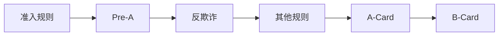

## 单变量分析

> 数据挖洞: 用以显著提高数据的判断能力

- Label: [0, 1, 2]
- `2`: 为`0-1`的过度阶段
- 特征挖掘、指标挖掘、规则挖掘

```mermaid
graph LR
    准入规则-->Pre-A;
    Pre-A-->反欺诈;
    反欺诈-->其他规则;
    其他规则-->A-Card;
    A-Card-->B-Card;
```

> 各步骤是否使用相同的特征？

- 一般不使用相同的特征进行复筛选；可能出现数据偏移。

> ABCDEF --> 拒绝多少的人

---

