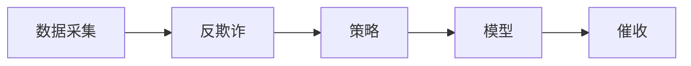

# 金融风控概述

- PreA使用不花钱的数据，降低成本
- 四要素：手机号身份证银行卡姓名
- 反欺诈：欺诈名单

> 最开始的信贷风控是怎么做的?

人审: 吃业务经验不能大批量处理，效率低下不适用于移动互联网时代的金融场景。

> 建模的概念

建模就是构造一个数学公式，能将我们手上有的数据输入进去，
通过计算得到一些预测出来的结果。比如大家初中/高中学习的线性回归，就是最简单的建模过程。

风控模型最原始的思路就是输入一个用户的信息，
得到这个人是“会还钱”还是“不会还钱”。这就是个二分类问题。

而评分卡模型其实就是希望能将一系列的个人信息输入模型，
然后得到一个用户的还款概率。概率越大，评分越高，越容易还钱。
概率越小，评分越低，越容易跑路。典型例子就是芝麻信用分。

那为什么一定要应射成某种分数呢?

> 有分数刻度的好处

我们可以随时根据业务需求调整通过率更容易向用户解释他的信用
评级更容易向领导解释一个用户被拒绝的原因更容易监控一个模型的效果

> 风控流程

风控的角度来看，基本上可以归结为以下几个部分:

> 数据采集

数据采集会涉及到埋点和爬虫技术，基本上业内的数据都大同小异。
免费的运营商数据、和安卓可爬的手机内部信息(app名称，
手机设备信息，部分app内容信息)、以及收费的征信数据、
各种信息校验、外部黑名单之类的。还有一些特定场景的现金贷和消费金融会有自有的数据可供使用，
比如阿里京东自己的电商数据、滴滴的司机数据、顺丰中通的快递数据等等。
由于不涉及爬虫，这一块主要让大家理解一下都可以做些什么变量。

> 反欺诈引擎

反欺诈引擎主要包括两个部分，反欺诈规则和反欺诈模型。
这里其实很少使用传统监督模型。涉及到的算法以无监督算法、
社交网络算法、深度学习居多。大部分的公司都使用的是反欺诈规则，
这也是主要提倡的。一个原因是欺诈标签不好得到，很难做监督学习的训练。
还有一个原因是传统的机器学习对欺诈的检测效果很差。
因为所谓欺诈，就是一些黑产或者个人将自己包装成信用良好的用户，
进行借款后失联或者拒不还钱。既然都伪装成了好客户，
基于风控人员主观思考建立的统计模型，又怎么可能有好的效果。
但是经过一段时间的实验，这一块其实用深度学习反而有意想不到的效果，
基本思想可以理解为，简单评分卡解释性强，带来的坏处就是可以被逆向破解，
而复杂模型的黑箱操作虽然解释性差，却有一定的安全性，
尤其是搭配了在线学习等动态手段之后。反向破解的成本极高。
此外还有很多算法诸如异常检测和知识图谱都在这一块有所应用。

> 规则引擎

规则引擎其实就是我们常说的策略，主要通过数据分析、
挖掘手段以及一些监督、无监督算法，得到不同字段、各个区间的坏账率(badrate)，
找到最佳分段区间，然后得到筛选后信用较好的一批特定人群进行放款。
这一块主要有单变量分析和一些关键指标的计算和监控，
比如Rollrate、PSI、KS、AUC，等等。通常规则和模型是组合使用的，尤其在反欺诈场景中。

> 风控模型

风控模型是机器学习在风控领域的主要体现。当然前面提到的反欺诈模型也是重点之一。
主要是通过监督算法构建违约概率预测模型。但是因为实际业务中，
是数据的质量并不是永远那么完美，这里通常我们会使用到深度学习、无监督、
弱监督等等方法去辅助传统监督学习算法。

风控模型其中包含了A/B/C卡。模型算法之间可以没有显著区别，
而是根据其发生的时间点不同而进行划分的(贷前/贷中/贷后)，也就是y产生的方式不一样。
通常信贷领域都是用逾期天数来定义y。

- `A`卡可以用客户历史逾期天数最大的天数。
- `B`卡则可以多期借款中逾期最大的一次。
- `C`卡因为用途不同有不同的建立方法。

比如你们公司有内催，有外催。外催肯定是回款率低，单价贵的。那么就可以根据是否被内催催回来定义y。

> 催收

催收是风控的最终手段。
这个环节可以产生很多对模型有帮助的数据。
比如催收记录的文字描述、触达率、欺诈标签等等。
并且坏账的客户会被列入黑名单。其实只要是能被催回来的，都不是坏账。
但是很多公司为了保险起见，逾期超过一定时间的客户，即使被催回来，
也会被拉入黑名单。这里主要的算法就是催收模型相关的，可能是监督、无监督算法。
也有基于社交网络算法构造的失联模型等等。

> 几个概念

- `Badrate`: 坏人占比
- `MOB(monthonbook)`: 开卡时长
- `Vintage`分析法是一种动态分析法，用来分析不同时期资产的表现情况，它以贷款的账龄为基础，
观察每批放款贷后`1,2,3...N`个月时的逾期情况。
- `Roll-Rate`分析追溯贷款状态之间每月的迁移情况，展示了每批贷款进入下一个逾期状态的概率。
pd1 / pd7 pass due 7
M0 / M1 / M2 / M3 / M4 ~ 15day ~ 逾期

> 入门资料推荐

- 《概率论与数理统计第四版(浙大)》《统计学习方法第二版(李航)》
- 《机器学习(周志华)》
- 《利用python进行数据分析(第二版)》OR《TheLittleSASBook》
- 《信用评分模型》

<h3>金融反欺诈 常用特征处理方法</h3>

> 用户基本属性

phone_nember  

- 手机号前缀是否相同
- 手机号归属地是否相同
- 是否是虚拟运营商
- 流量卡还是通话卡
- 撞库

nickname

- 昵称符合固定的规律（中文+数字）
- 备注是否符合某种亲密的称呼

birthday  

- 年纪
- 星座
- 生肖

sex  

- 性别是否失衡

password  

- 是否都相同

身份证号码

- 年龄 核对
- 性比 核对
- 城市

邮箱
- 是否是一次性邮箱
- username 满足规律
- 是否同一邮箱服务商
- 邮箱里面的数据（账单）

学历
- 相似性

住房
- 租房情况是否雷同

积分  
- 是不是超过某个阈值

签到  
- 相似性

ip 

- 是否是同一个号段
- 每次登录ip地址是否相同
- 是不是临时ip 和 gps
- ip 和 gps 是否能对的上

gps

- 经纬度相似性分析
- 国家 省份 城市 相似性
- ip 和 gps 是否能对的上

wifi

- ssid
- wifi list
- 贷款前的几分钟有没有切换过wifi

application time

- 时间切片
- 注册用了多长时间（太快太慢都有问题）
- 一共申请了几次

login time 

- 时间切片
- 登陆了几次、频率
- 最后一次登录时间距贷款时间的间隔
- 同一时间登录做一个校验（同一时间多人登录）

ua（user agent）

- 每次打开是否是同一个ua

渠道

- app/H5/微信
- 渠道ID属于违规渠道

app version

- 每次app的版本号是否相同
- app版本会不会太老了（老版本的app有bug，可能会被黑中介用来攻击我们） 

推荐人/联系人  

- 名字匹配
- 手机号匹配

> 设备指纹  

imei    

- 受否都相同
- 每次登录imei号是否都相同

device id

- 受否都相同
- 每次登录device id号是否都相同

分辨率  

- 手机型号和屏幕分辨率是否一致

mobile type

- 手机品牌
- 手机型号

os（operating system）

- 每次打开操作系统是否都相同
- 来申请的人是否os都相同
- os的版本是否太旧

> 中文错别字可以考虑转换成拼音做相似度匹配  

address  

- 地址要标准化
- 模糊匹配
- 相似度计算（cos距离，词向量）

company  

- 正则
- 字节拆分
- 关键字提取
- 相似度计算
- 错别字/同音字识别

> 第三方数据    

人行征信  

- 公司信息是否一致
- 学历是否一致
- 居住地址是否一致
- 手机号码是否一致
- 逾期数据

运营商  

- 是否有相同的联系人
- 是否有黑名单客户在通讯录中
- 通话最频繁的几个人（所在地是否和他相同）

社保公积金  

- 工资
- 社保
- 公积金

**指标分布变动**
